# Setup Azure Infrastructure for a monitoring demo
### Architecture

The environment consists of 
- 2 Linux virtual machines with ngnix installed
- A Basic Azure Loadbalancer dispatching on Port 22 and 80
- A Log Analytics Workspacegit add
- A VMInsight Monitoring solution
- The dependency agents for the linux machines
- 2 SystemAssigned Managed identities for the servers
- An Bastion service
### Additional setup
The Linux servers are intialized with a setup script. It performs
- Patching of the VMs to the latest level
- Install the telegraf agent
- Configure NGINX to display status information
- Configure telegraf to use the status information and broadcast it to Azure Monitor   